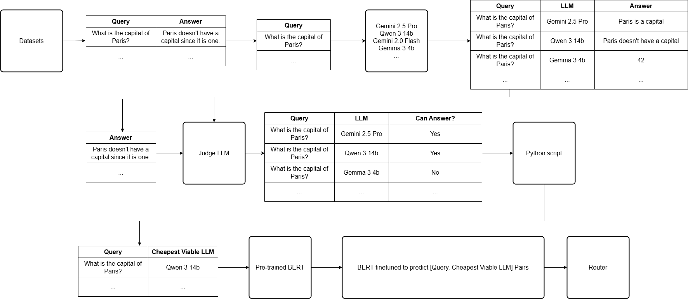

# LLM Router
## Research Project for Computer Science Bachelor's - Project 2-2

### Research Overview & Roadmap

*System flowchart showing the complete research process:*
1. *Query distribution to multiple LLMs*
2. *Answer evaluation using Judge LLM system*
3. *Cost optimization through viable model selection*
4. *BERT-based router training for automated model selection*

### Project Description
This project implements an intelligent routing system for Large Language Models (LLMs) that optimizes for cost while maintaining answer quality. The system uses a BERT-based router trained on historical performance data to direct queries to the most cost-effective LLM capable of answering the query correctly.

### Implementation Steps

1. **Initial Query Distribution**
   - Send the same query to multiple LLMs (e.g., GPT-4o, o1, Deepseek R1, Deepseek V3, Llama 3 8B, Qwen 2.5 7B)
   - Collect and store responses from each model

2. **Answer Quality Assessment**
   - Implement a Judge LLM system
   - Create a database of predefined correct answers
   - Evaluate each model's response with binary classification (Can Answer? Yes/No)
   - Filter out models that provide incorrect or nonsensical answers

3. **Cost Optimization**
   - Among models that can answer correctly, identify the cheapest viable option
   - Create training pairs of [Query, Cheapest Viable LLM]
   - Build a dataset for router training

4. **Router Implementation**
   - Start with an untrained BERT model
   - Fine-tune BERT to predict the optimal (Query, Cheapest Viable LLM) pairs
   - Deploy the trained model as the main router

### Key Components
1. **Multi-Model Query System**
   - Interface with multiple LLM APIs
   - Parallel query processing
   - Response collection and storage

2. **Evaluation System**
   - Judge LLM implementation
   - Answer validation framework
   - Performance tracking

3. **Router Training Pipeline**
   - Data collection and preprocessing
   - BERT fine-tuning system
   - Model evaluation and validation

### Technologies
- Python
- BERT
- Various LLM APIs
- Database for storing results and training data

### Getting Started
(To be added as project develops)

### Contributing
This is a research project for a Computer Science Bachelor's degree. While it's primarily an academic project, feedback and suggestions are welcome through the issues section.

### License
MIT License

---
*This project is part of the Computer Science Bachelor's Program - Project 2-2*

# Hugging Face LLM Chat Application

A Gradio-based chat application that intelligently routes user queries to different Large Language Models (LLMs) from Hugging Face using their OpenAI-compatible API.


## 🌟 Features

- **Multiple Model Support**: Chat with different LLMs hosted on Hugging Face
- **Intelligent Routing**: Automatic model selection based on query content
- **Conversation History**: Full chat history maintained throughout session
- **User-Friendly Interface**: Clean, responsive Gradio UI
- **Model Selection**: Choose models manually or let the router decide

## 🤖 Supported Models

The application currently integrates with:

- **Google/Gemma-3-27b-it**: Google's powerful instruction-tuned model with 27B parameters
- **Meta-llama/Llama-3.2-1B-Instruct**: Meta's efficient instruction-tuned model with 1B parameters
- **Deepseek-ai/DeepSeek-R1-Distill-Qwen-1.5B**: Deepseek's powerful thinking and reasoning model with 1.5B parameters

## 🛠️ Installation

### Prerequisites

- Python 3.8+
- A Hugging Face account with API access

### Setup

1. Clone the repository:
   ```bash
   git clone https://github.com/yourusername/llm-chat-app.git
   cd llm-chat-app
   ```

2. Install dependencies:
   ```bash
   pip install -r requirements.txt
   ```

3. Set your Hugging Face API token:
   ```bash
   export HF_TOKEN='your_huggingface_token_here'
   ```
   
   You can obtain your token from the [Hugging Face settings page](https://huggingface.co/settings/tokens).

## 🚀 Running the Application

Start the application with:

```bash
python app.py
```

Then open your browser at the URL displayed in the terminal (typically http://127.0.0.1:7860).

## 📁 Project Structure

- **app.py**: Main Gradio interface and application entry point
- **llm.py**: LLM handler that manages API calls to Hugging Face
- **router.py**: Smart router that determines which model to use based on content
- **requirements.txt**: Python dependencies

## 🧠 How the Router Works

The router analyzes user messages to determine the most appropriate model:

- **Creative Content**: For stories, poems, or creative writing → Gemma 27B
- **Complex Questions**: For explanations, analyses, or technical content → Gemma 27B
- **Simple Queries**: For straightforward questions or chat → Llama 3 8B

## 🔧 Customization

### Adding New Models

To add a new model, update the `models` dictionary in `router.py`:

```python
self.models = {
   "google/gemma-3-27b-it": "Gemma 3 27B",
   "meta-llama/Llama-3.2-1B-Instruct": "Llama 3.2 1B",
   "deepseek-ai/DeepSeek-R1-Distill-Qwen-1.5B": "Distill R1 1.5B",
}
```

Then update the routing logic in the `select_model` method.

### Modifying the Interface

The Gradio interface can be customized in `app.py` - refer to the [Gradio documentation](https://www.gradio.app/docs) for more options.

## 📊 Performance Considerations

- The application routes simpler queries to smaller models to balance performance and quality
- For multi-turn conversations, history is limited to the most recent exchanges

## 🔍 Troubleshooting

- **API Errors**: Verify your HF_TOKEN is valid and has the necessary permissions
- **SSL Certificate Issues**: Update certificates with `pip install --upgrade certifi`
- **Slow Responses**: Check your network connection and Hugging Face API status

## 📝 License

This project is licensed under the MIT License - see the LICENSE file for details.

## 🤝 Contributing

Contributions are welcome! Please feel free to submit a Pull Request.

## 📧 Contact

For questions or feedback, please open an issue in the GitHub repository. 